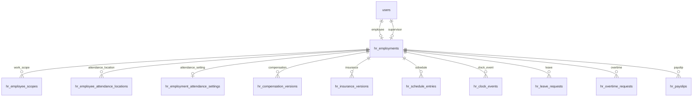

# HR 系統設計

本文定義目前 HR 員工模型與跨模組邊界。實際欄位以 [hr-people schema](../packages/db/src/schema/hr-people.ts) 為準，查詢與並行規則以 [hr-people service](../packages/db/src/hr-people.ts) 為準；本文件不另維護一份建表 SQL。

## 一、架構邊界

平台由既有 `users`、D1、Drizzle、Hono API、`apps/portal` 管理介面與 `apps/hr` 本人介面組成。業務規則放在 `packages/db/src/hr-*.ts`，API route 只負責解析輸入、權限與回應；Portal 與 HR app 不自行判定員工是否活動，也不自行計算正式薪資。

| 領域 | 唯一來源／邊界 |
|---|---|
| 帳號 | `users` 保存姓名、Email 與 `status`；停用帳號和員工封存是兩個操作 |
| 員工主檔 | `hr_employments`；員工編號、目前職位、主管與 `archived_at` 都在同一列 |
| 出勤 | `hr_employment_attendance_settings`、工作範圍、辦公位置與 append-only clock events |
| 敘薪／保險 | `hr_compensation_versions`、`hr_insurance_versions` 自己維護版本，不因職位更新自動新增版本 |
| 排班／假勤／加班／獎金／薪資 | 以穩定 `employmentId` 關聯，保留各領域自己的快照、版本與稽核歷史 |
| 操作稽核 | 共用 `activity_events`；既有 `hr_employment_actions` 僅作歷史保留，不再作為目前狀態來源 |
| 權限 | `packages/auth/src/permissions.ts` 是唯一來源；後端每次請求重新判定，不信任前端顯示 |

## 二、員工資料模型



`users 1 ─── 0..1 hr_employments` 的「0..1」是活動員工關係：資料庫允許同一 User 留下一筆已封存列，但部分唯一索引保證同一時間最多一筆 `archived_at IS NULL`。

### `hr_employments` 契約

| 欄位 | 規則 |
|---|---|
| `id` | 穩定 `employmentId`；任何下游歷史不得因封存而換 ID |
| `employee_user_id` | RESTRICT FK 至 `users.id` |
| `employee_number` | 1～40 字元；活動列 partial unique |
| `position` | 1～100 字元；目前職位唯一來源 |
| `supervisor_user_id` | 可為 NULL；設定時必須是另一位活動員工且帳號 active |
| `archived_at` | NULL 是活動；非 NULL 是封存時間 |
| `revision` | 一般編輯與封存／重新啟用的競態控制版本；封存的業務欄位只更新 `archived_at` |
| `created_at`／`updated_at` | 主檔時間；歷史查詢不可拿它推導在職狀態 |

活動條件固定寫成 `hr_employments.archived_at IS NULL`。不得以 `users.status`、目前日期、到職日或離職日替代。

### 職位與敘薪

升遷／調職只對活動列執行 `UPDATE position`，不新增 `hr_employments`，不改 `employmentId`，不自動建立 `hr_compensation_versions`。薪資異動必須由敘薪服務建立自己的版本，保留生效期間、版本號、操作者與下游薪資快照。

## 三、生命週期與一致性

### 指派與重新啟用

`assignHrEmployee` 在同一個 D1 batch 內：

1. 檢查 User 為 `active` 或 `invited`，並找出既有封存列。
2. 建立新列，或以原列 ID 清除 `archived_at`、更新員工編號／職位。
3. 建立或更新 `hr_employment_attendance_settings`。
4. 寫入 activity event。

partial unique index、`RETURNING` mutation guard 與 batch 失敗回滾共同防止重複指派、編號衝突及半套資料。重新啟用沿用同一 ID，不建立第二筆活動任職。

### 封存

`archiveHrEmployment` 的資料更新刻意限定為：

```sql
UPDATE hr_employments
SET archived_at = CURRENT_TIMESTAMP
WHERE id = ? AND archived_at IS NULL
RETURNING id;
```

成功後才寫 `employment_archived` activity event。封存不物理刪除員工列、出勤、打卡、工作範圍、薪資、保險、假勤、加班、排班、獎金、薪資結算或 audit history。舊 client 的 `/end`、`/withdraw` 路由僅作相容別名；新 UI 使用 `/archive`。

### 並行寫入

- 員工編號與活動 User 的唯一性由資料庫 partial unique index 仲裁。
- 封存使用 `archived_at IS NULL` 條件；第二個並行封存會得到空 mutation 並回 409。
- 編輯職位／編號／主管只允許活動列，資料庫 constraint 錯誤轉為可理解的 409。
- 下游建立工作範圍、出勤位置、薪資或請假資料前，必須以 `archived_at IS NULL` 驗證；歷史讀取則以 `employmentId` 直接查詢。
- D1 batch 是原子邊界；不可用 JavaScript 的 read-check-write 取代條件 UPDATE，也不可讓前端提供任意 `employeeUserId` 代表本人。

## 四、下游資料契約

所有下游資料都保存 `employment_id`。活動員工清單、薪資計算、出勤、排班、主管審核與新增關聯使用未封存條件；歷史報表、已結帳薪資單、已發生打卡與稽核查詢不因封存排除既有列。

- 出勤：活動員工才能新增打卡、位置指派與排班設定；clock event append-only，歷史列保留原 `employmentId`。
- 假勤／加班：申請建立時驗證活動員工；審核與結算讀取原 employment history，不回寫員工主檔職位。
- 敘薪／保險：版本表維持自己的 `versionNumber` 與期間；薪資單保存員工編號、姓名與實際版本快照。
- 排班／特殊工作日／獎金：活動員工才進入新的發布或計算集合；已發布結果仍可依原 employment history 重現。
- 據點／scope：表示工作範圍，不是 HR 管理權限；scope assignment 的歷史 FK 不因員工封存而刪除。

## 五、Migration 與歷史保留

扁平化不能直接把舊列重建成新 ID，也不能以 `DROP TABLE` 連坐刪除下游資料。migration 採結構／資料分離：

1. `0174` 由 schema 產生過渡欄位，保留舊表與歷史表。
2. `0175` 回填 employee number、主管與 `archived_at`；既有 employment ID 原值保留，沒有任職列的舊 employee record 才補一個穩定 legacy ID。
3. `0176` 建立正式欄位的暫存父表，`0177` 搬移資料。
4. `0178` 由 schema 產生所有下游 FK 轉移；對敘薪／薪資單的子表先建立無 FK 的暫存副本、移除子表、重建父表後再依 schema 恢復子表與資料，絕不以 `PRAGMA foreign_keys=OFF` 刪除仍被引用的父表。`0179` 在子表完成轉移後交換父表名稱並重建受影響 trigger。
5. `0180` 在沒有 FK 依賴後才移除 `hr_employees`。

`hr_employment_actions` 與共用 activity history 保留；migration 測試以 D1 transaction 模式驗證舊 employment ID、下游 FK、trigger、`foreign_key_check` 與已封存列。不得把 generated migration SQL 事後改成另一份 schema；必要的資料搬移另以獨立 migration 檔案保存。

## 六、API、權限與 UI

主要端點：

| Endpoint | 語意 |
|---|---|
| `GET /api/hr/candidates` | 列出尚未有活動員工列的 `active`／`invited` User |
| `GET /api/hr/employees` | 依 `archived_at` 列出目前或已封存員工 |
| `POST /api/hr/employees` | 指派或重新啟用，建立／更新出勤設定 |
| `PATCH /api/hr/employees/:id` | 同列更新員工編號與目前職位 |
| `PATCH /api/hr/employees/:id/supervisor` | 設定或清除主管 |
| `POST /api/hr/employments/:id/archive` | 封存，保留所有歷史 |
| `PATCH /api/hr/employments/:id/attendance-mode` | 更新出勤設定，不改職位或 employment ID |

員工列表／基本資料需要 `hr:employee:read`；指派、編輯、封存與主管需要 `hr:employee:write`；出勤設定使用 `hr:office:read/write`；薪資、保險、假勤與打卡明細仍依各自敏感資料權限。本人 API 只依 session user 找活動 `hr_employments`，不得接受 URL／body 的替代 User ID。

Portal 沿用 Material 3 元件、`.page.fills`／`.panel.grows`、sticky `.data-table`、既有 Dialog、Tooltip 與 design tokens。列表主要操作靠右，危險操作使用 archive 語意；手機與鍵盤操作必須有可見焦點、欄位 label、錯誤文字與足夠 hit area。封存員工仍可進入內頁查歷史，但不可被活動員工入口或本人 HRIS 判定為目前員工。

## 七、驗收與部署邊界

- schema migration 從空庫與有舊資料的資料庫各跑一次；每支 migration 用 D1 transaction 測試。
- 測試活動 User／員工編號的並行唯一性、封存競態、重啟用同 ID、FK 完整性與 trigger。
- 驗證升遷／調職不建立新列、不改敘薪版本；驗證封存只更新業務欄位 `archived_at`，並讓 `revision` 前進以阻擋舊請求，且下游歷史可查。
- API、Portal、HR app 分別 typecheck、test、build；瀏覽器驗證列表、內頁、封存／重新啟用、職位／主管與權限邊界。
- 本機遵守 repo 規範，不執行 wrangler；Worker 與 D1 實機部署由 CI 驗證。寫入錯誤以修復／調整處理，不刪 HR 表回滾歷史。
