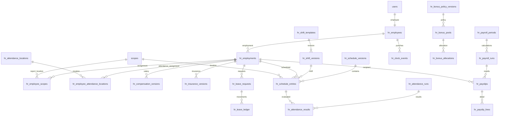

# HR 系統設計

本文定義 HR 擴充的領域邊界，不代表已通過法遵審查。人事基礎的實際欄位以 [hr-people schema](../packages/db/src/schema/hr-people.ts) 為準，API 與並行規則以 [hr-people service](../packages/db/src/hr-people.ts) 為準。待辦唯一來源為 [README 下一步](../README.md#下一步)；開發操作依 [development-workflow](./development-workflow.md)。

## 一、邊界與依賴

HR 提供員工入口、排班、打卡、請假／加班、績效分配、審核與薪資結帳。資料與 API 沿用 D1、Drizzle、登入、Material 3 UI 與權限目錄；員工本人介面由 `apps/hr` 建置成獨立前端，管理介面留在 `apps/portal`，兩者共用 `apps/api`。辦公位置是獨立於報表 scope 的 geolocation 設定目錄，不新增第二套員工登入或 SQL 方言。

| 既有來源 | 整合方式與影響 |
|---|---|
| `packages/db/src/schema/auth.ts` 的 `users` | 平台使用者是員工身分來源；被指派後以 `user_id` 關聯，帳號停權即時禁止操作，離職與帳號停權不是同一狀態 |
| `packages/db/src/schema/reports.ts` 的 `scopes` | 報表、排班與營運歸屬使用其 ID；HR 員工 scope 指派不改報表通路語意，出勤 geolocation 規則另由 HR 出勤設定中的辦公位置管理 |
| `report_payout_daily`、`report_item_sales_monthly` | 僅為可選業績來源；出金不自動等於營業額，商品月報不能推出個人業績 |
| `activityEvents`／`recordActivity()` | 沿用操作索引；擴充型別與 HR 可見性，敏感明細留在 HR 授權路徑 |
| `packages/auth/src/permissions.ts` | 權限鍵唯一來源；DB permission 表仍只是鏡像 |
| `apps/api/src/routes/cyberbiz-reports-mcp.ts` | 現有唯讀 MCP 不是 HR 寫入授權；未來另接具備員工身分的 adapter |
| `apps/api/src/local-d1/d1.ts` | 本機與測試沿用同一 D1 介面，不新增另一個 SQLite 模擬器 |

業務與查詢放 `packages/db/src/hr-*.ts`；schema 依人事、出勤、薪資等穩定邊界放 `schema/hr-*.ts` 並由 `schema/index.ts` 匯出。API 負責解析、驗權與回應，前端 app 不自行計算正式薪資。純計算函式與資料載入分離以便測試，不另引入通用規則框架。

## 二、先決制度與產品決策

下列答案是相依功能的設計關卡，不以程式預設取代雇主決策：

| 決策 | 影響／未確認時的邊界 |
|---|---|
| 員工數、是否多法人、同時多份聘僱 | 第一版員工直接來自既有 `users`，不新增雇主建檔或帳號綁定；若未來真的有多法人，再以薪資／投保需求新增法人實體，不讓 scope 代替法人 |
| 月／日／時薪及年資認列 | 薪資版本、到離職、復職、假別額度 |
| 工時制度、跨夜、分段班、休息時間 | 班次規則與法遵檢查；不預設已取得變形工時必要程序 |
| 10:30～19:30 為 50% 日薪的意義 | 時段與給薪係數分離；未確認合法計薪方式前不開放此係數用於正式結帳 |
| 團體業績來源、退貨／負值、個人業績歸屬 | 不以出金或零值默認替代；第一版可人工匯入經核准的業績 |
| 獎金保底、月中到離職、跨櫃與權重 | 預設提案是扣除門檻後非負池、固定權重；是否按出勤比例仍需批准 |
| 發薪日、出勤結算區間、投保／扣繳 | 結算期不必等於曆月；投保與薪資所屬期分開 |
| GPS、指定網路、設備限制 | 初版由辦公位置設定是否必須 geolocation 與允許半徑；本人打卡頁載入時嘗試取得瀏覽器定位並做預檢，伺服器以請求時位置重新計算，拒絕 GPS 不得打卡；座標不出現在一般出勤列表 |
| 自審例外、薪資覆核與匯出權限 | 原則禁止自審，例外必須顯式授權及留理由 |

法遵由當期勞動部、勞保局、健保署及必要的財稅官方資料確認，並由雇主人資／勞務顧問核定。規則版本需保存來源 URL、適用日期、確認者；本文件不聲稱已查核最新費率或已符合勞基法。至少涵蓋最低工資、工時／休息／例休假、各類加班、法定假別、特休與補休、勞就職保／健保／勞退、扣繳及保存期限。公司政策可優於法定條件，不能讓任意係數繞過法定下限。

## 三、ERD（主要實體）

ERD 省略審核、附件與快照明細關係；以下資料字典描述後續領域的表邊界。已落地的具體欄位與 SQL 約束以 Drizzle schema 為唯一來源，不能另維護平行建表 SQL。

## 四、SQL 共通契約

- 以下欄位以 SQL snake_case 表示；TypeScript 採 camelCase。`id` 為 text 主鍵，時間使用 text，金額／秒數／比例使用 integer。不使用 SQLite REAL 計算薪資。
- 除明列複合主鍵的純關聯外，每表有 `id`；可變表有 `created_at`、`updated_at`、`revision`（預設 1 且大於零），不可變紀錄有 `created_at`。狀態採 text + CHECK，不只 TypeScript union。
- `*_id` 明列對應表並建立 FK；可空者標 `?`。預設 NOT NULL；外鍵以 RESTRICT 為主。`created_by`／審核者指向 users 並保存必要名稱快照，歷史資料不可隨帳號刪除。
- 有效日期採 `[valid_from, valid_to)`，`valid_to?`；CHECK 結束大於開始。班次區間採同樣半開規則，相鄰不重疊。
- 工作日 `YYYY-MM-DD`、結算月份 `YYYY-MM`；事件時間使用一致 UTC ISO 格式與精度，禁止混用 `CURRENT_TIMESTAMP` 與 ISO 事件字串排序。共通紀錄時間可沿用現有 timestamp 慣例，但不得當作工作時間來源。
- 薪資 `*_minor` 為新台幣分；報表整數金額先確認為元再乘 100 進 HR。工時保存整數秒，給薪分鐘的捨入另由核定規則處理。比例 `rate_ppm`：1,000,000 = 100%；權重 `weight_units` 為正整數。
- 乘除中間值用精確整數／有理運算，寫回需檢查安全整數範圍。明列項目捨入、薪資單整元處理及尾差，禁止每一步任意四捨五入。
- JSON 僅用於不可變計算說明、外部來源摘要；員工、scope、金額、期間、狀態與關聯仍為正式欄位。不允許可執行任意公式字串或 eval。
- 所有外鍵查詢路徑建立子表索引，含 RESTRICT 檢查；索引前綴 `idx_hr_`、CHECK 前綴 `ck_hr_`，避免全域撞名。下表列出業務唯一性與主要查詢索引，實作 review 仍逐一列出 FK 索引。

### 4.1 人事、範圍與規則

人事基礎使用 `users.id` 作為 `hr_employees.user_id` 的主鍵與外鍵，不再複製姓名，也不新增雇主或帳號綁定表。其他實體使用 text ID、RESTRICT 外鍵、revision 與半開日期區間。`ended_on` 表示不再任職的第一天，不是最後出勤日。復職新增任職，結束任職前先結束超出期間的櫃點與辦公位置指派；同一使用者的任職期間不可重疊。

員工指派與全平台人事讀寫是獨立明確權限，不預設授予現有主管／同仁角色；員工指派直接選現有 user，完成後該 user 由 session 身分取得本人入口，不需要另一個本人讀取權限。櫃點指派只是工作歸屬，不能當作管理授權。不存在或已是員工的 user 不可重複指派；離職不自動停權，帳號停權也不刪歷史。

基礎指派與結束入口不提供刪除或覆寫已結束期間；正式審核修訂與未來法人／薪資設定依下列擴充設計處理。platform 的 `/hr/employees` 不提供打卡、排班或薪資計算；hr app 的 `/clock` 提供本人打卡日曆與打卡入口，`/forms` 提供補打卡申請，`/profile` 顯示本人資料，打卡事件仍由後端依伺服器時間與辦公位置規則判定。主管審核與其他管理入口留在 platform。

| 表 | 專屬欄位與關聯 | SQL 約束／主要索引 |
|---|---|---|
| `hr_employees` | `user_id → users.id`、`employee_number`、`supervisor_user_id? → users.id` | user_id PK/FK；員工編號唯一、非空；主管由後台指派且不得為本人 |
| `hr_employments` | `employee_user_id → hr_employees.user_id`、`hired_on, ended_on?, seniority_start_on` | 日期有效；同 user 的任職期間不可重疊；索引 user + hired_on |
| `hr_employee_scopes` | `employment_id`、`scope_id → scopes.id`、`valid_from, valid_to?` | 報表／營運 scope 的任職歸屬；期間不可重疊；scope + valid_from 索引 |
| `hr_attendance_locations` | `name, geolocation_required, latitude_e7?, longitude_e7?, radius_meters` | 辦公位置名稱唯一；定位開啟時座標成對且有效；半徑 1～10000 公尺 |
| `hr_employee_attendance_locations` | `employment_id → hr_employments.id`、`location_id → hr_attendance_locations.id`、`valid_from, valid_to?` | RESTRICT 外鍵；期間半開；同一辦公位置的期間不可重疊，同一段任職可同時指派多個辦公位置 |
| `hr_employment_attendance_settings` | `employment_id → hr_employments.id`、`attendance_mode`、`primary_assignment_id? → hr_employee_attendance_locations.id` | 每段任職一列；一般辦公／排班由受控值表示；主要位置用 pointer 保存，不改寫歷史指派 |

出勤設定頁透過後端 Google Maps Places API（Text Search）搜尋地點，管理者直接選取結果後由系統帶入座標；本人打卡頁由 `apps/hr` 使用開源 MapLibre GL JS 搭配 OpenFreeMap 向量圖磚，套用品牌 style JSON，支援拖曳與手勢縮放且不顯示地圖工具按鈕。圖磚服務需保留 OpenFreeMap／OpenStreetMap attribution；MapLibre 本身不代表圖磚服務永久沒有流量限制。若向量圖磚載入失敗，才退回由 Worker 代理的 Static API 圖片。Worker 的 Places／Static 金鑰只放 secret；前端不需要 Google Maps JavaScript 瀏覽器金鑰。正式環境仍需設定 `GOOGLE_MAPS_API_KEY`、Places API (New) 與 Maps Static API；若改用自建 MapLibre style，只需覆寫 `VITE_MAPLIBRE_STYLE_URL`。

| `hr_management_scopes` | `user_id, scope_id` | 複合 PK；只授予範圍，不自行授予功能權限 |
| `hr_work_rule_versions` | `employer_id, version_number, valid_from, valid_to?, rule_kind, source_url, confirmed_by` | 未來多法人定案後才加入；唯一 employer + version_number；允許的 rule_kind CHECK |
| `hr_compensation_versions` | `employment_id → hr_employments.id`、`version_number, valid_from, valid_to?, pay_basis, base_amount_minor, note, created_by` | 唯一 employment + version_number；pay_basis 為 monthly/daily/hourly，金額非負；期間重疊由服務層防止，新版本可原子關閉前一個開放版本 |
| `hr_pay_components` | `code, name, direction, treatment_code` | code 唯一；earning/deduction/employer_cost；treatment 對應受控法遵分類，不以名稱判斷工資 |
| `hr_compensation_components` | `compensation_version_id, pay_component_id, amount_minor` | 複合 PK；金額非負 |
| `hr_insurance_versions` | `employment_id → hr_employments.id`、`scheme, version_number, status, valid_from, valid_to?, insured_amount_minor, dependent_count, rate_year, source_kind, source_url, note, created_by` | 唯一 employment + scheme + version_number；勞保／健保分開版本，健保眷屬 0～3；官方／人工來源與年度留存，期間重疊由服務層防止 |
| `hr_statutory_rate_versions` | `scheme_code, version_number, valid_from, valid_to?, source_url, confirmed_by` | 唯一 scheme + version_number |
| `hr_statutory_rate_brackets` | `rate_version_id, bracket_number, lower_minor, upper_minor?, insured_amount_minor, employee_rate_ppm, employer_rate_ppm` | 唯一 version + bracket；有效金額／比例範圍 |

投保制度、薪資項目分類與 rate bracket 欄位需以匿名真實案例驗證，不表示所有保險都只靠單一百分比可算。特殊資格、固定負擔、補充保費、扣繳等若需要獨立資料應在薪資階段補模型，不以任意 JSON 代替。銀行／身分證等私密資料不預先加到一般員工列表；必要時用受控的獨立資料與存取路徑。

### 4.2 排班、事件與出勤

| 表 | 專屬欄位與關聯 | SQL 約束／主要索引 |
|---|---|---|
| `hr_shift_templates` | `employer_id, code, name, active` | 唯一 employer + code |
| `hr_shift_versions` | `shift_template_id, version_number, start_second, end_second, end_day_offset, pay_factor_ppm` | 唯一 template + version；當日時刻 0～86399；跨日區間為正；係數非負但合法性另驗 |
| `hr_shift_breaks` | `shift_version_id, sequence, start_offset_seconds, end_offset_seconds, paid` | 唯一 version + sequence；區段為正、paid 0/1；服務層驗證位於班內且互不重疊 |
| `hr_scope_shift_assignments` | `scope_id, shift_template_id, is_default` | 複合 PK；partial unique scope WHERE is_default=1 |
| `hr_schedule_versions` | `employer_id, period_start, period_end, version_number, status, supersedes_id? → 同表, submitted_by?, approved_by?, decision_reason?` | 唯一 employer + period_start + period_end + version；狀態 CHECK |
| `hr_schedule_entries` | `schedule_version_id, employment_id, scope_id, shift_version_id, work_date, starts_at, ends_at` | 結束大於開始；索引 employment + work_date、scope + work_date |
| `hr_clock_sources` | `source_kind, source_key, active` | 唯一 kind + key；portal/rfid/line/manual |
| `hr_clock_events` | `employee_user_id, employment_id, attendance_location_id?, source_kind, idempotency_key, event_kind, latitude_e7?, longitude_e7?, distance_meters?, occurred_at, received_at` | Portal idempotency key 唯一；索引 employee_user_id + occurred_at；事件不可覆寫；事件時間存 UTC，顯示轉 Asia/Taipei；定位開啟時保存當次距離 |
| `hr_form_requests` | `employee_user_id, employment_id, form_kind, status, correction_date, requested_event_kind, requested_at, reason, approver_user_id?, submitted_at, reviewed_at, review_comment?` | 目前只開放補打卡；草稿／申請中／已核准／已駁回；審核者預設取員工主管；補打卡時間存 UTC；送出後不可由申請人修改 |
| `hr_clock_correction_requests` | `employment_id, schedule_entry_id?, original_event_id?, proposed_at, proposed_kind, reason, status, submitted_by, reviewed_by?, reviewed_at?, decision_reason?` | 狀態 CHECK；索引 employment + status |
| `hr_attendance_runs` | `employer_id, period_start, period_end, input_revision, engine_version, status, request_id` | request 唯一；狀態 CHECK |
| `hr_attendance_results` | `attendance_run_id, schedule_entry_id, worked_seconds, late_seconds, early_seconds, missing_kind, status` | 唯一 run + entry；秒數非負 |
| `hr_attendance_event_links` | `attendance_result_id, clock_event_id` | 複合 PK |
| `hr_attendance_correction_links` | `attendance_result_id, correction_request_id` | 複合 PK |

同一法人歸屬（例如班表 employer 與 employment employer）、修訂前後員工一致性，必須以複合 FK 能表達的部分加以保護，其餘在原子服務驗證，不能只驗每個 ID 各自存在。確切複合鍵與發布根表在排班切片設計 review 定案，不將本候選字典直接視為可執行 migration。

班表版本不可只用「每 scope 最新」發布，否則跨櫃衝突會漏查；發布在 employer 範圍驗證相關員工所有有效班次。不同日期範圍的版本亦不可互相重疊生效。發布後整版不可變，修改產生新版本並保留被替代版本。

一天可能多班，不設 employee + work_date 唯一。無班打卡顯示異常並保留事件，不直接丟棄或算零工時；經確認建立工作區段後再計算。每日最早／最晚只是摘要：分段休息、跨午夜、跨櫃、只有一次打卡均以班次與核准調整判定。晚離開不能直接等同加班，也不能僅因未申請而抹除實際工作事實。

### 4.3 假別、申請與特殊日

| 表 | 專屬欄位與關聯 | SQL 約束／主要索引 |
|---|---|---|
| `hr_leave_policy_versions` | `employer_id, leave_code, version_number, valid_from, valid_to?, unit_kind, pay_rate_ppm, entitlement_rule_code, source_url` | 唯一 employer + code + version；受控假別規則 |
| `hr_leave_accounts` | `employment_id, leave_policy_version_id, entitlement_start, entitlement_end, revision` | 唯一 employment + policy + entitlement_start；作為額度並行控制根 |
| `hr_leave_requests` | `employment_id → hr_employments.id`、`leave_type, status, starts_on, ends_on, duration_minutes, reason, reviewed_by?, reviewed_at?, review_comment?, created_by` | 草稿／待審核／核准／駁回／取消狀態 CHECK；期間與時數正值；employment + starts_on 索引；目前供內頁歷史檢視，申請流程另行切片 |
| `hr_leave_request_segments` | `leave_request_id, sequence, starts_at, ends_at, requested_seconds` | 唯一 request + sequence；區段及秒數正值 |
| `hr_leave_ledger` | `leave_account_id, leave_request_id?, movement_kind, quantity_seconds, expires_on?, idempotency_key` | idempotency 唯一；取得／保留／使用／釋放／到期／結清等種類 CHECK |
| `hr_overtime_requests` | `employment_id, scope_id, requested_start, requested_end, actual_start?, actual_end?, settlement_kind, status, reason, reviewed_by?, reviewed_at?, decision_reason?` | 區段 CHECK；employment + requested_start 索引；pay/compensatory 類型 |
| `hr_special_day_events` | `employer_id, starts_at, ends_at, event_kind, pay_rule_code, reason, status` | 區段與狀態 CHECK |
| `hr_special_day_scopes` | `event_id, scope_id` | 複合 PK |
| `hr_special_day_entitlements` | `event_id, schedule_entry_id, employment_id, eligible_seconds` | 唯一 event + entry；凍結原排班給薪資格 |

假別資格／額度可由規則衍生，但仍需員工申請及審核，不從缺卡推論法定假別。實際未出勤時段與請假重疊只處理一次，不可遲到又扣請假。補休另需連回加班來源、換算版本、期限與結清依據；在補休功能 PR 加入具體 FK 明細，而非塞進 ledger 備註。

颱風事件不是國定假日的別名。日薪資格以事件確認時原已發布的班表列凍結，後補排班不自動增加給薪資格；修正需另行審核。月／日／時薪依核定政策分別處理，實際出勤與停班給薪不可重複計入。

申請各自保有 FK 與狀態，程式共用審核函式，不建立 entity_type + entity_id 的萬用申請表。附件使用各申請的明確關聯；儲存沿用既有媒體能力前先確認私密授權，不能把病假證明或薪資檔變公開網址。

### 4.4 獎金與業績

| 表 | 專屬欄位與關聯 | SQL 約束／主要索引 |
|---|---|---|
| `hr_bonus_policies` | `employer_id, code, name` | 唯一 employer + code |
| `hr_bonus_policy_versions` | `policy_id, version_number, scope_id, performance_kind, revenue_kind, rate_ppm, threshold_minor, valid_from, valid_to?` | 唯一 policy + version；team/individual；金額非負、比例 0～1000000 |
| `hr_bonus_policy_members` | `policy_version_id, employment_id, valid_from, valid_to?, weight_units` | 唯一 version + employment + valid_from；權重大於零 |
| `hr_bonus_pools` | `policy_version_id, period_start, period_end, calculation_version, status, pool_amount_minor, approved_by?` | 唯一 policy_version + period_start + period_end + calculation_version |
| `hr_bonus_revenue_snapshots` | `bonus_pool_id, scope_id, employment_id?, source_kind, source_start, source_end, amount_minor, captured_at, provenance_json` | scope + source_start 索引；個人歸屬經服務層驗證 |
| `hr_bonus_allocations` | `bonus_pool_id, employment_id, weight_units, amount_minor, rounding_adjustment_minor` | 唯一 pool + employment；權重大於零 |

團體計算提案：`max(0, revenue - threshold) × rate_ppm / 1000000` 為池；每人按有效權重除以權重總和分配。權重 1/1/2 得 25%/25%/50%，全員為 1 即均分。同一員工可參加不同池，但同池只能分配一次。相同公式文字不代表同一池，以明確池 ID 決定共享範圍。

個人績效依可信個人業績歸屬計算，不把團體數字直接當每人業績；多筆個人歸屬總額與來源總額需要對帳。缺業績與實際零業績不同。退貨、跨期調整、月中異動、門檻是否按人／按池為需核定規則。

報表重匯可改變來源列，故核准時保留獎金池、業績及參與名單快照，不能只存 report_run_id 後回查現值。查報表期間也可能重匯：需在單一一致讀取取得來源，或以可驗證的來源版本／重算檢查完成擷取，不能多個分頁讀完就假設一致。明細分批擷取方案需在該 PR 以並行重匯測試證明。

尾差以固定員工 ID 次序或核定最大餘數法處理，結果必須穩定且分配總和等於池額。修改核准結果產生新計算版本，歷史薪資仍指原版本。

### 4.5 薪資

| 表 | 專屬欄位與關聯 | SQL 約束／主要索引 |
|---|---|---|
| `hr_payroll_periods` | `employer_id, period_key, attendance_start, attendance_end, pay_date, status` | 唯一 employer + period_key；有效區間；open/closed |
| `hr_payroll_runs` | `payroll_period_id, version_number, request_id, input_revision, engine_version, status, expected_count, completed_count, approved_by?` | request 唯一；唯一 period + version；每 period 僅一個 closed run 的 partial unique index |
| `hr_payroll_run_employees` | `payroll_run_id, employment_id, input_revision, status, last_error?` | 複合 PK；員工批次重試單位 |
| `hr_payslips` | `payroll_run_id, employment_id, earning_minor, deduction_minor, net_minor, published_at?` | 唯一 run + employment；net = earning - deduction；負實領標異常不能自動付款 |
| `hr_payslip_lines` | `payslip_id, line_key, pay_component_id, direction, amount_minor, quantity_seconds?, explanation_json` | 唯一 payslip + line_key；金額非負；direction CHECK |
| `hr_payslip_bonus_links` | `payslip_line_id, bonus_allocation_id` | 複合 PK；正式採用同一 allocation 不得重複發薪，另由結帳檢查保護 |
| `hr_payslip_attendance_links` | `payslip_id, attendance_result_id` | 複合 PK |
| `hr_payslip_compensation_links` | `payslip_id, compensation_version_id` | 複合 PK；月中調薪可引用多版 |
| `hr_payslip_insurance_links` | `payslip_id, insurance_version_id` | 複合 PK；投保與費率版本可追溯 |
| `hr_payslip_leave_links` | `payslip_line_id, leave_request_id` | 複合 PK；連回核准且不可變的假單區段 |
| `hr_payslip_overtime_links` | `payslip_line_id, overtime_request_id` | 複合 PK；實際核定時段與給付方式可追溯 |
| `hr_payslip_special_day_links` | `payslip_line_id, special_day_entitlement_id` | 複合 PK；連回凍結給薪資格 |
| `hr_payroll_adjustments` | `original_payslip_id, target_period_id, direction, amount_minor, reason, status, approved_by?, idempotency_key` | key 唯一；金額正值 |
| `hr_payslip_adjustment_links` | `payslip_line_id, adjustment_id` | 複合 PK；正式採用不得重複 |
| `hr_payroll_payments` | `payslip_id, amount_minor, paid_at, reference, idempotency_key` | key 唯一；允許分次支付；付款不是薪資結帳狀態 |

薪資結果須保存姓名／員工編號等必要顯示快照與所有實際輸入版本。明細總和、付款總和、調整是否已採用由結帳服務原子驗證，不能只相信前端傳入 totals。雇主成本不進員工扣款。底薪、固定津貼、績效、加班、未出勤、保險、自提及扣繳分類分別計算；項目名稱不能自行決定是否屬工資或加班基礎。

## 五、一致性與不可變性

### 狀態

| 領域 | 允許流程 |
|---|---|
| 申請 | draft → submitted → approved/rejected；submitted 可撤回，核准後撤銷以反向紀錄處理 |
| 班表 | draft → submitted → published/rejected；published 不原地修改，以新版本取代 |
| 出勤／獎金試算 | queued → running → succeeded/failed；核准的結果另存批准資訊，不覆寫 |
| 薪資 | queued → running → ready/failed → approved → closed；付款獨立記錄 |

每次變更檢查 `expected_revision`；過期編輯回 409。審核內容與送審 revision 綁定，不能審核自己未看過的新內容。若允許退回編輯，重新送審必須新 revision。狀態更新與額度／關聯副作用屬同一原子單位。

### D1 寫入策略

不假設能跨 HTTP 請求持有 transaction，也不以 JavaScript 的 read-check-write 保證並行安全。D1 batch 的整批失敗回滾語意依 [D1Database 官方文件](https://developers.cloudflare.com/d1/worker-api/d1-database/#batch)；實作時重新核對，local-d1 測試不能代替正式執行環境驗證。

- 單列狀態以 `UPDATE ... WHERE revision=? AND status=?` 條件更新並檢查 affected rows。
- 多列審核／保留額度／發布以 D1 支援的原子 batch 加上 DB guard 設計；**條件 UPDATE 影響零列不等於 batch 失敗**。依賴寫入必須同樣受 guard 限制，或有可驗證、失敗會回滾整批的約束，禁止無條件接著新增 ledger。
- 期間重疊、leave 超用、跨櫃排班與單次結帳需要共享根 revision／鎖定範圍；具體 SQL 先以競爭測試驗證，再開放入口。不能宣稱 unique(valid_from) 已防止期間重疊。
- 專案保守上限是每 SQL 少於 100 個 bound variables，不宣稱這是所有 D1 最新產品配額。依欄數計算分批大小，索引涵蓋外鍵與期間查詢。
- 薪資長批次先凍結輸入集合與版本，再按任職紀錄計算；每人結果原子寫入，可用固定 line_key 重試。不以多批普通 upsert 覆寫已發布結果。
- 最終發布以原子檢查確認所有預期人員齊備、結果成功、來源 revision 未變、核准有效、獎金／調整未被其他正式結算消耗。若輸入已變，標為失效要求新 run，不局部重算混成一版。
- 發布前不可見半份薪資；結帳後來源改動只提示差異並產生調整。一般 API 不提供已結帳刪改。

## 六、入口、權限與私密資料

以下只定義後續功能的授權契約；正式權限以 `permissions.ts` 為唯一來源。人事基礎使用 `hr:employee:read`、`hr:employee:write`，本人入口只要求登入且由 `users.id → hr_employees.user_id` 判定，不新增或同步另一個本人讀取權限。API 只允許 `AUTH_APP_ORIGINS` 列出的前端 origin；正式環境 session cookie 使用 `.rueisiang.com`，帶 session 的寫入請求必須有核准的 Origin 或 Referer。

| API／UI 契約（候選） | 權限 | 資料範圍與驗證 |
|---|---|---|
| `/api/hr/me`、`/me/clock-events`、`/me/schedule`、`/me/attendance` | 僅需登入／未來依功能要求 | 只由 session user 解析 employee，不接受代指定本人 ID |
| `/api/hr/candidates`、`/employees` POST | `hr:employee:write` | 從既有 users 選取；不得任意建立第二個人員身分 |
| `GET /api/hr/me/attendance-calendar`、`/attendance-location/check`、`/attendance-map/locations`、`/attendance-map` | 僅需登入且必須是本人 | 日曆依有效任職與目前週一至週五基準標示未打卡日；定位檢查由伺服器重新計算，任一指派辦公位置在半徑內即可打卡；地圖座標供 hr app 的 MapLibre／OpenFreeMap 使用，圖磚載入失敗時由 Worker 代理 Static API 圖片 |
| `POST /api/hr/me/clock-events` | 僅需登入且必須有現行任職 | 伺服器產生事件時間與上下班 kind；使用 idempotency key；定位開啟時由伺服器檢查距離，網站不允許回填時間 |
| `/api/hr/me/form-requests` | 僅需登入且必須是本人；審核路徑限指定審核者或 `hr:request:review` | 補打卡申請可存草稿、送出與查詢狀態；審核者填寫意見後核准或駁回 |
| `/api/hr/me/leave-requests`、`/overtime-requests`、`/clock-corrections` | `hr:request:create` | 本人；申請可表達歷史時間但需審核 |
| `GET /api/hr/employees`、`GET /api/hr/employees/:id`、`POST/PATCH /api/hr/employees` | `hr:employee:read/write` | 列表支援固定 page size、總數、搜尋、狀態篩選與白名單排序；內頁採單一互斥 accordion。此表記法代表各自 read、write 鍵；薪資、投保、請假與打卡明細另限全平台 HR 管理者 |
| `/api/hr/schedules`、`/:id/publish` | `hr:schedule:write/approve` | 功能權限 AND hr_management_scopes；同時驗 employer 邊界 |
| `/api/hr/attendance-settings/locations`、`/places`、`/employments/:id/attendance-location`、`/employees/:id/supervisor` | `hr:office:read/write` 或 `hr:employee:write` | 管理出勤設定中的辦公位置與員工主管；Places 搜尋與座標選取限管理權限；員工辦公位置與主管都從員工管理建立，不因指派取得管理權限 |
| `/api/hr/attendance`、申請 `/:id/review` | `hr:attendance:read/approve` | 授權範圍及不可自審；請假私密附件不隨全櫃點可讀 |
| `/api/hr/bonus-pools` | `hr:bonus:write/approve` | 來源與參與範圍；改政策不等於批准獎金 |
| `POST /api/hr/employments/:id/compensation`、`/insurance`、`GET /api/hr/insurance-brackets` | `hr:employee:write/read` 且薪資／投保寫入限全平台 HR 管理者 | 版本期間不可重疊；薪資與勞健保明細不提供 scoped manager；官方級距即時由勞動部／健保署來源解析，人工覆寫需保存來源與年度 |
| `/api/hr/payroll-runs`、`/:id/close` | `hr:payroll:calculate/approve/close` | 個別權限；雇主範圍需在多法人確認後以明確授權關聯加入 |
| `/api/hr/me/payslips` | `hr:payslip:read-self` | 僅本人已發布薪資單 |
| `/api/hr/payroll-exports` | `hr:payroll:export` | 獨立匯出權限、逐次稽核、私密下載 |

跨法人管理不以空 scope 表示全權；具體 employer 授權表需與法人制度一同定案。API 列表、單筆、批次、匯出、附件皆實施相同範圍判斷，權限每請求依現有授權機制重讀。

platform 沿用 M3 元件，提供 HRIS 管理功能與辦公位置設定；員工本人介面獨立部署在 `hr.rueisiang.com`，以手機 App 形式提供表單申請、置中的打卡日曆與個人資訊。打卡首頁載入時即嘗試取得瀏覽器定位，伺服器仍是範圍判斷的最終來源；補打卡表單可存草稿並追蹤申請中、已核准、已駁回。AI／Excel 排班輸入先存草稿、來源附件與不確定欄位，經人類發布才生效。platform 的帳號選單提供「我的人事資料」連到 HR app。

RFID 簽章、防重送、設備綁定與撤銷；LINE 透過可信 channel 身分解析既有 `user_id`／員工，不信任模型傳來的 employee_user_id。小香專屬整合資料同時含 assistantKey 與 channelKey 並引用 channel 主鍵。模型不能直接結帳或核准自己的代送申請。離線裝置事件同時保留 occurred_at／received_at，超出可信時間窗口轉待確認，不當即時網站打卡。

薪資、身分證、銀行帳號、請假證明不得進通用可見的 audit payload、錯誤或公開媒體 URL。快取按授權隔離；私密下載須短效／不可公開快取。資料留存、刪除申請、備份存取與法定保存年限以正式核定制度設定，不能把帳號刪除 cascade 成出勤／工資紀錄刪除。

## 七、開發切片與驗收契約

實際操作沿用 repo workflow 與 pre-pr-check skill，不在本文件複製另一份 Git 操作手冊。每個切片從最新 origin/main 在獨立 worktree 分支開發；schema／migration 由該切片單一負責者統整，UI／API 可依核定契約平行協作，不共用工作目錄。人類確認 merge；交叉 review 不自行核准為正式上線。

| 切片 | 交付邊界 | 進入下一階段的證據 |
|---|---|---|
| 設計 | ERD、資料字典、權限、制度問題與案例 | 人類確認制度、schema review 找出不變量與關鍵 query |
| 員工基礎 | 從既有 users 指派員工、任職／復職、櫃點歸屬與本人入口 | 不重複指派、任職不重疊、停用保留歷史、本人只能看 session 對應資料 |
| 排班 | 班次版本、快速排班、送審／發布 | 跨櫃衝突、分段／跨夜、同時發布、已發布不可覆寫 |
| 打卡出勤 | 網站事件、補卡、異常、出勤計算 | 單卡、重送、跨夜歸屬、休息、無班打卡、補卡後重算 |
| 假別加班 | 申請、額度、補休、特殊日 | 並行超用、撤回退額度、法定案例、颱風排班資格凍結 |
| 獎金 | 來源擷取、政策、池、分配與審核 | 1/1/2、全員均分、負業績、缺資料、月中異動、重匯及尾差 |
| 薪資 | 設定／投保、試算、覆核、結帳、薪資單／匯出 | 中斷重試、雙重結帳、來源變動、明細對帳、權限與調整單 |
| 外部入口 | RFID、LINE／MCP、圖片排班草稿 | 可信身分、重送／偽造／撤銷、人工確認、不繞過薪資權限 |

每個功能切片交付 schema、業務邏輯、API、必要 UI、測試及文件，不先堆出全部空表。完成內容自設計文件移除，實作單一來源回到程式碼；未完成事項只在 README 更新。

### SQL 與計算驗收

- migration 從空庫與現行 schema 升級兩條路徑驗證，每支 migration 一個 transaction 模擬 D1；包含 FK 完整性與歷史資料保留。
- 不直接手改產生的建表 SQL。需要資料搬移依 repo 的新增／搬移／收斂流程，不 DROP 被子表引用的父表，不依賴 transaction 中的 PRAGMA foreign_keys=OFF。
- unique、CHECK、FK 的非法資料直接 SQL 測試；不能只有 API happy path。
- 測試相同／不同 effective_from 的交疊期間、相鄰合法區間、兩管理者同時發布／審核／結帳。
- 工時跨月跨年、閏日、單卡、重複卡、午休、跨櫃、部分請假與加班重疊；不以出勤最早最晚直接差值計薪。
- 薪資匿名黃金案例：月中到離職／調薪／投保異動、各假別、颱風、各加班類別、工資性質、特殊扣繳、負實領及尾差。
- 已結帳後改員工姓名、班表、獎金政策、報表來源或投保級距，原薪資單仍可重現；原始事件與來源版本可追溯。
- 至少兩個完整月份與現行人工薪資平行對帳，差異逐項由人資確認；另以案例測試低頻法規情境。

### 部署與回復設計

程式 PR 執行相關 typecheck、test、build，CI 驗證 API Worker 與 HR 靜態 Worker 的部署設定；不在本機執行 wrangler。`platform.rueisiang.com` 維持 API／platform 靜態資產同 Worker，`hr.rueisiang.com` 由 `apps/hr/wrangler.toml` 獨立部署，build 時以 `HR_API_BASE_URL` 指向共用 API。新 schema 優先 additive，入口按切片開放，禁止未完成計薪規則直接正式發薪。部署前按既有部署能力準備可恢復資料保護並確認回復責任人，不在本設計假定某個備份服務已開通。

上線 smoke 使用核准測試員工／資料，驗證本人打卡、跨員工拒絕、主管審核、薪資私密性及稽核；結果留 PR／部署紀錄，不能以本機 fixture 宣稱實機通過。回復優先停用新入口與回退相容程式，保留新增歷史表；寫入錯誤走修復／調整，不刪 HR 表回滾。migration 與 Worker 部署失敗分別判斷，不假設程式回退會回退資料。
